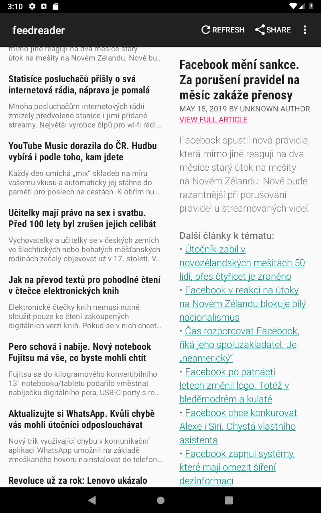
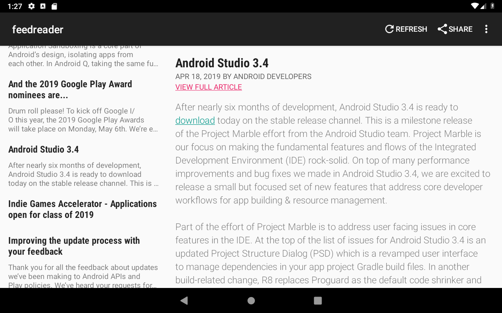
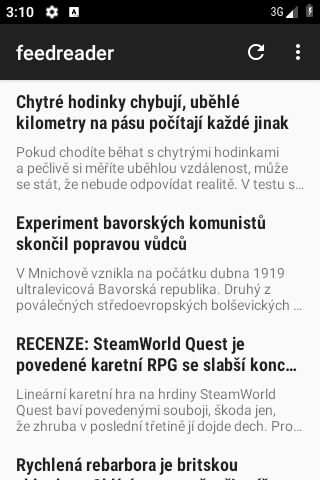
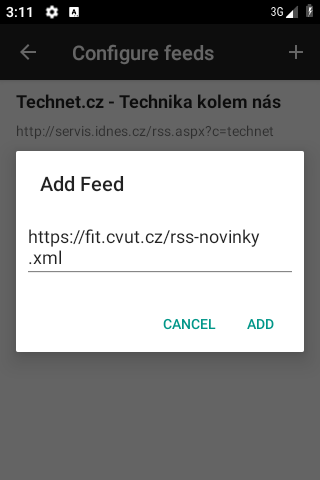
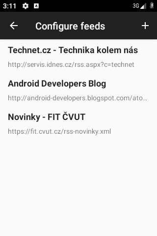

# FeedReader

FeedReader is a small app that reads RSS feeds and presents the articles to the user.

## UI for tablets

## UI for phones

## Technologies and Libraries:
- ROOT Library for local storing feeds
- Android ROME for downloading RSS and ATOM feeds
